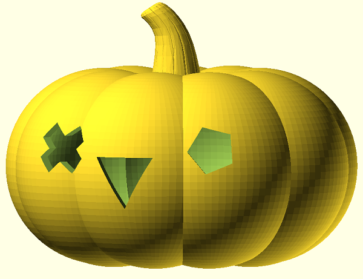
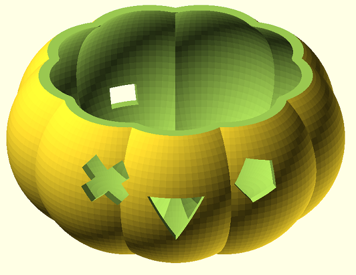
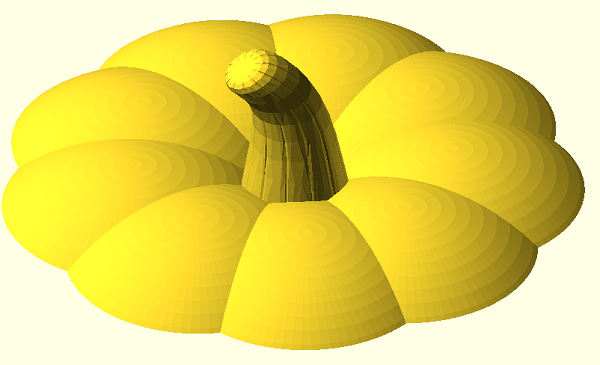

# NeoPixel-Pumpkin

## NANO/UNO und NeoPixel-Ring mit 12 LEDs 

  

  |[:skull:ISSUE](https://github.com/frankyhub/NeoPixel-Pumpkin/issues?q=is%3Aissue)|[:speech_balloon: Forum /Discussion](https://github.com/frankyhub/NeoPixel-Pumpkin/discussions)|[:grey_question:WiKi](https://github.com/frankyhub/NeoPixel-Pumpkin/wiki)||
|--|--|--|--|
| | | | |
||<a href="https://github.com/frankyhub/NeoPixel-Pumpkin/issues">|<a href="https://github.com/frankyhub/NeoPixel-Pumpkin/discussions">|<a href="https://github.com/frankyhub/NeoPixel-Pumpkin/releases">|
| <a href="https://github.com/frankyhub/NeoPixel-Pumpkin/pulse" alt="Activity">| <a href="https://github.com/frankyhub/NeoPixel-Pumpkin/graphs/traffic">  |<a href="https://github.com/frankyhub?tab=stars"> |

---

